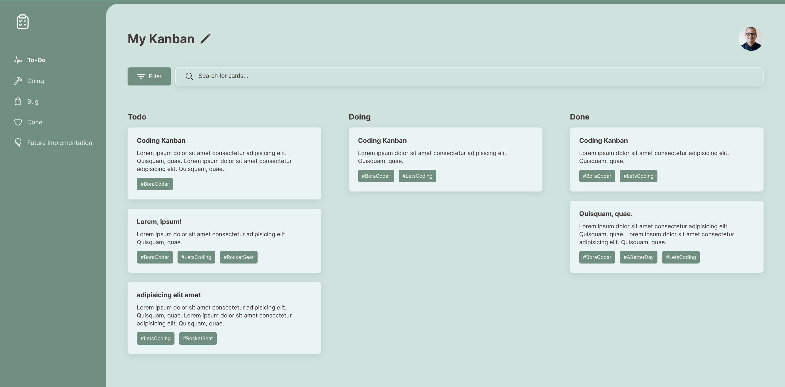

  <h1 align="center">💻 Kanban board</h1>

## Details:

This is a project developed during the 7th challenge of the `#boraCodar` which means `letsCoding` from `RocketSeat` community, which is a community of developers who are always looking to improve their skills and help others.
- HTML
- CSS

> See this project on Figma: [Kanban board](https://www.figma.com/file/0eTaNaB7GdaenTAYDkIssc/%23boracodar---Desafio-12-(Community)?node-id=11-31&t=s358gss85nUagCAN-0)

## 📷 Screenshots:

  

## 🤝 References:

- [Colors Palette](https://coolors.co/palette/6b9080-a4c3b2-cce3de-eaf4f4-f6fff8)
- [Ionic Icons](https://ionic.io/ionicons)
- [RocketSeat](https://rocketseat.com.br/)
- [Mayk Brito](https://github.com/maykbrito)

---

<strong>Built with 💙 by [@Marcos Oliveira](https://www.linkedin.com/in/pgmarcosoliveira/)</strong>